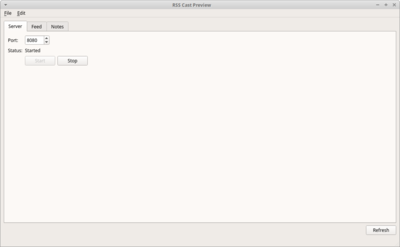
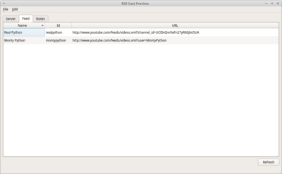

# RssCast

Convert (forward) Youtube channels and playlists to podcast RSS.

Main rationale behind the project was to provide simple and lightweight application allowing to
provide Youtube videos in form of audio feed. Application does not need any form of Youtube API key.
The goal is achieved using third party webside executing the conversion. 


## Disclaimer

Application uses `http.server` module. According to module's home page:
 
> `http.server` is not recommended for production. It only implements basic security checks.

so it's advisable not to expose the server to public network.


## Screens

[](doc/mainwindow-server-big.png)
[](doc/mainwindow-feed-big.png)


## Running 

To run application simply execute `startrsscast` script:
```
startrsscast
```

Application accepts following arguments:

<!-- insertstart include="doc/cmdargs.md" -->## <a name="main_help"></a> startrsscast --help
```
usage: startrsscast [-h] [--minimized] [--fetchRSS] [--refreshRSS]
                    [--reduceFiles REDUCEFILES] [--startServer]

RSS Cast

options:
  -h, --help            show this help message and exit
  --minimized           Start minimized
  --fetchRSS            Update RSS channels
  --refreshRSS          Update RSS channels and download content
  --reduceFiles REDUCEFILES
                        Remove old files reducing files numbers to given
  --startServer         Start RSS server
```
<!-- insertend -->


## How it works?

Application reads Youtube feeds taken from `Feed` table. Each feed is parsed and converted to proper RSS 
compatible with podcast applications. From each video audio file is extracted. RSS and audio files are 
stored locally and exposed to local network using configuration from `Server` tab.

Published content by default can be seen on `http://localhost:8080`. 

Meaning of _Feed_ table columns:
- _Name_ -- descriptive name of given feed
- _Id_ -- identifier of the feed to be distinguished
- _Url_ -- source address of the feed

For each feed there is converted RSS available under address `http://{host}:8080/feed/{feed_id}/rss`.

For example `Id` field with value `examplechannel` will lead to following RSS: `http://localhost:8080/feed/examplechannel/rss`. 


## Similar projects

- YouCast
- podsync


## References:

- https://www.rssboard.org/rss-profile
- https://yt1s.com
- https://docs.python.org/3/library/http.server.html
- https://github.com/yt-dlp/yt-dlp
