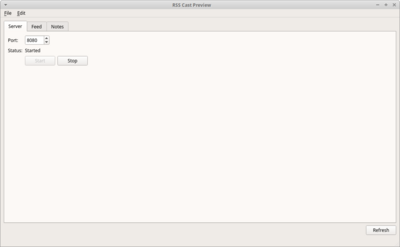

# RssCast

Convert (forward) Youtube RSS channels to podcast RSS.

Main rationale behind the project was to provide simple and lightweight application allowing to
provide Youtube videos in form of audio feed. Application does not need any form of Youtube API key.
The goal is achieved using third party webside executing the conversion. 

By default each converted audio feed is available at address: _http://{local_ip}:8080/feed/{id}/rss_ 

## Screens

## Similar projects

- YouCast
- podsync

## References:

- https://www.rssboard.org/rss-profile
- https://yt1s.com
